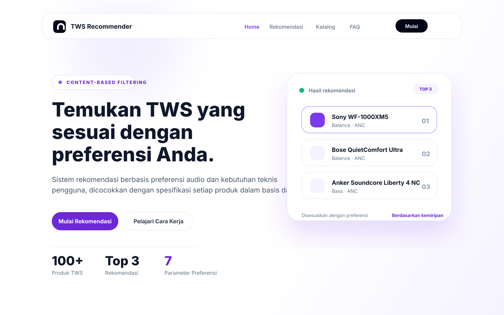

# TWS Recommender

TWS Recommender adalah aplikasi rekomendasi True Wireless Stereo (TWS) berbasis preferensi pengguna. Aplikasi ini membantu pengguna menemukan produk TWS yang sesuai dengan kebutuhan audio, fitur, dan penggunaan harian melalui pendekatan **Content-Based Filtering**.



## Fitur Utama

- **Rekomendasi berbasis preferensi pengguna** untuk menemukan TWS yang paling sesuai.
- **Content-Based Filtering** untuk menghitung kecocokan antara preferensi pengguna dan spesifikasi produk.
- **Katalog produk TWS** sebagai sumber data utama dalam proses rekomendasi.
- **Antarmuka web responsif** dengan tampilan modern dan mudah digunakan.
- **Backend API terpisah** untuk mengelola data dan proses rekomendasi.

## Teknologi

- **Frontend:** Next.js, React 19, Tailwind CSS v4, lucide-react
- **Backend:** FastAPI, Python 3.11+
- **Database:** MongoDB
- **Metode Rekomendasi:** Content-Based Filtering

## Struktur Project

```text
tws-recommender/
├── backend/      # API, koneksi database, dan logika rekomendasi
├── frontend/     # Aplikasi web berbasis Next.js
├── tws.json      # Dataset produk TWS
└── README.md     # Dokumentasi project
```

## Persyaratan

Pastikan perangkat sudah memiliki:

- **Node.js** untuk menjalankan frontend.
- **Python 3.11+** untuk menjalankan backend.
- **MongoDB** sebagai database.
- **npm** sebagai package manager frontend.

## Instalasi dan Menjalankan Project

### 1. Backend

Masuk ke folder backend:

```bash
cd backend
```

Buat dan aktifkan virtual environment:

```bash
python -m venv venv
venv\Scripts\activate
```

Install dependency backend:

```bash
pip install -r requirements.txt
```

Buat file `.env` di dalam folder `backend`:

```env
MONGO_URI=mongodb://localhost:27017
DB_NAME=tws_recommender
```

Jalankan server backend:

```bash
uvicorn app.main:app --reload
```

Backend berjalan di:

```text
http://localhost:8000
```

### 2. Frontend

Masuk ke folder frontend:

```bash
cd frontend
```

Install dependency frontend:

```bash
npm install
```

Jalankan aplikasi frontend:

```bash
npm run dev
```

Frontend berjalan di:

```text
http://localhost:3000
```

## Environment Variables

Konfigurasi environment backend disimpan pada file `backend/.env`.

| Variable | Deskripsi | Contoh |
| --- | --- | --- |
| `MONGO_URI` | URI koneksi MongoDB | `mongodb://localhost:27017` |
| `DB_NAME` | Nama database yang digunakan | `tws_recommender` |

## Alur Kerja Sistem

1. Pengguna memilih preferensi TWS melalui halaman rekomendasi.
2. Backend mengambil data produk dari database.
3. Sistem menghitung kecocokan berdasarkan atribut produk dan preferensi pengguna.
4. Aplikasi menampilkan daftar produk TWS dengan tingkat kecocokan terbaik.

## Lisensi

Project ini dibuat untuk kebutuhan pengembangan sistem rekomendasi TWS.
